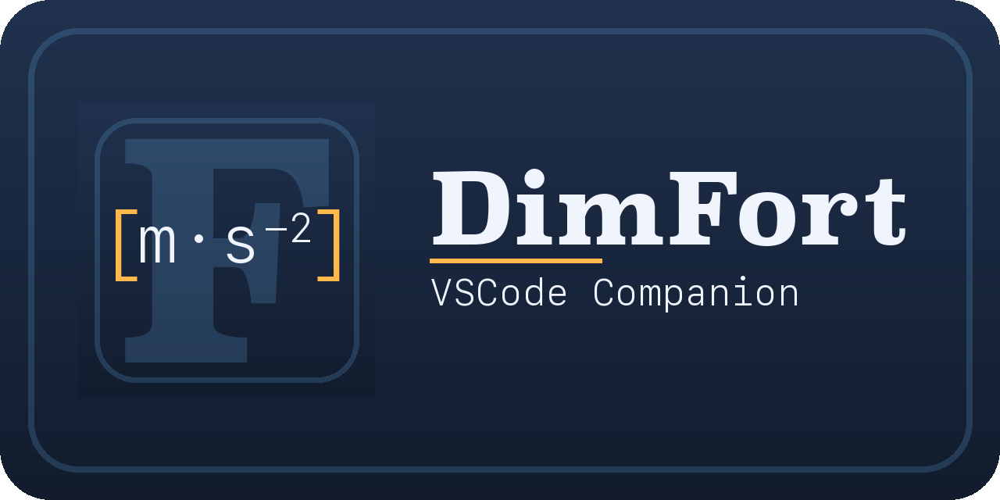

# DimFort — VSCode extension



VSCode client for [DimFort](https://github.com/ArrialVictor/DimFort) —
the dimensional-homogeneity checker for Fortran. Thin Language Server
Protocol client: spawns `dimfort lsp` and forwards your Fortran
sources to it; the server publishes diagnostics back, and VSCode
renders them as squiggles and entries in the Problems panel.

## Setup

1. **Install DimFort** (the Python tool) and make sure `dimfort lsp`
   works from your shell. The LSP extra is required:

   ```bash
   pip install -e "/path/to/DimFort[lsp]"
   ```

   Tree-sitter is the parser; no external Fortran compiler is needed.

2. **Install the extension** in development mode:

   ```bash
   cd Homogeneity/DimFort-VSCompanion
   npm install
   npm run compile
   ```

3. **Launch the extension host**:
   - Open `Homogeneity/DimFort-VSCompanion/` in VSCode.
   - Press <kbd>F5</kbd> ("Run Extension"). A second VSCode window opens
     with the extension loaded.
   - Open any `.f90` file; you should see diagnostics on save.

## Configuration

Settings (under **DimFort** in the Settings UI):

- `dimfort.executable` — path to the `dimfort` binary. Default is just
  `dimfort` (must be on `$PATH`). Point this at your virtualenv's
  `bin/dimfort` if you installed locally — e.g.
  `/Users/me/.../DimFort/.venv/bin/dimfort`.
- `dimfort.trace.server` — set to `verbose` to see every LSP message
  in the **Output → DimFort** panel. Useful for debugging.

## Packaging a `.vsix`

The `.vsix` is a single installable bundle you can hand to teammates;
they run `code --install-extension dimfort-X.Y.Z.vsix` (or drag-drop
into the Extensions view) and they're done — no F5 dev mode, no clone.

Requirements: **Node ≥ 20.18** (older Node breaks `@vscode/vsce`'s
transitive `undici` dependency). If you're on macOS:

```bash
brew install node@20         # one-off
export PATH="/opt/homebrew/opt/node@20/bin:$PATH"
```

Then build:

```bash
cd Homogeneity/DimFort-VSCompanion
npm install                  # if you haven't already
npm install --save-dev @vscode/vsce
npm run compile
npx vsce package --allow-missing-repository
```

You'll get a `dimfort-vscode-0.0.1.vsix` file. Install it:

```bash
code --install-extension dimfort-vscode-0.0.1.vsix
```

Re-run `npx vsce package` after any change to rebuild.

The packaged extension ships only the **client** (TypeScript). Users
still need to install DimFort itself (`pip install dimfort` against
the upstream Python package, or build from source) and point
`dimfort.executable` at the binary.
